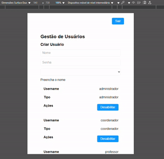

# Queiroz: Organização e controle para um ensino de excelência.

Queiroz é a solução definitiva para a gestão acadêmica em faculdades e universidades. Com uma interface intuitiva e ferramentas avançadas, Queiroz permite gerenciar usuários, semestres, cursos, disciplinas e matrizes curriculares de forma simples e eficiente.



## Tecnologias Utilizadas

* **Backend:** Quarkus (Java)
    * RESTful APIs
    * Integração com PostgreSQL (Hibernate Panache)
    * Segurança com Keycloak (OpenID Connect)
* **Frontend:** Angular
    * Comunicação com backend REST
    * Integração com Keycloak (`angular-auth-oidc-client`)
    * Design Responsivo
* **Banco de Dados:** PostgreSQL
* **Autenticação/Autorização:** Keycloak
* **Orquestração:** Docker, Docker Compose

## Configuração do Keycloak
Para evitar conflito de emissor do Keycloak é necessário modificar seu hosts file para que o endereço keycloak seja um
loopback localhost.

Para mapear o domínio "keycloak" para o endereço de loopback localhost, você precisa editar o arquivo de hosts tanto no
seu sistema. No Windows, edite o `C:\Windows\System32\drivers\etc\hosts` como administrator, adicione ao final as linhas
`127.0.0.1 keycloak` e `::1 keycloak`. No Linux, abra um terminal e edite o arquivo `/etc/hosts` com privilégios de
superusuário e adicione as mesmas linhas `127.0.0.1 keycloak` e `::1 keycloak`.

O endereço do keycloak foi um desafio, pois o quarkus verifica se o endereço do emissor é exatamente o endereço que 
ele próprio está se conectando ao keycloak. Como utilizar http://localhost para se conectar ao keycloak causava erro 
nessa validação do quarkus, pois ele se conecta por http://keycloak que é o nome do serviço no docker-compose, e 
para poupar tempo de configuração de proxys decidi trazer o mapeamento de loopback localhost para o endereço 
keycloak no hosts file da máquina. E essa diferença de endereço também provoca erros de CORS no Angular, que foram 
corretamente configurados na sua maioria, porém preferi tratar o gerenciamento de usuários diretamente no quarkus.

## Como Executar a Aplicação

1.  **Clone o repositório:**
    ```bash
    git clone https://github.com/dmarcostx/Queiroz
    cd Queiroz
    ```

2.  **Construir e Iniciar os Contêineres Docker:**
    A partir da raiz do projeto (`Queiroz`), execute:
    ```bash
    docker-compose up --build
    ```
    Este comando irá:
    * Construir a imagem Docker para o backend Quarkus.
    * Construir a imagem Docker para o frontend Angular (servido com Nginx).
    * Baixar e iniciar as imagens do PostgreSQL e Keycloak.
    * Configurar o Keycloak com o realm importado.

3.  **Acessar as Aplicações:**
    * **Frontend Angular:** [http://localhost:4200](http://localhost:4200)
    * **Backend Quarkus (API):** [http://localhost:8080](http://localhost:8080)
    * **Keycloak Admin Console:** [http://localhost:8180/admin/](http://localhost:8180/admin/)
        * Usuário: `admin`
        * Senha: `admin` (definida no `docker-compose.yml`)

    Ao acessar o frontend, você será redirecionado para a página de login do Keycloak. Use as credenciais abaixo.

    | Usuário (username) | Senha      | Papel (Role)    |
    | ------------------ |------------|-----------------|
    | `administrador`    | `admin123` | `administrador` |
    | `coordenador`      | `coord123` | `coordenador`   |
    | `professor`        | `prof123`  | `professor`     |
    | `aluno`            | `aluno123` | `aluno`         |


## Como Executar Testes Unitários do Backend

1.  **Navegue até o diretório do backend:**
    ```bash
    cd backend
    ```
2.  **Execute os testes Maven:**
    ```bash
    ./mvnw test
    ```
    (No Windows, use `mvnw.cmd test`)